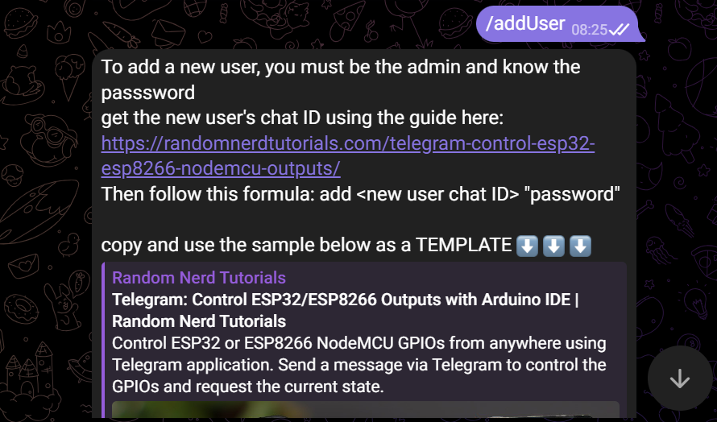
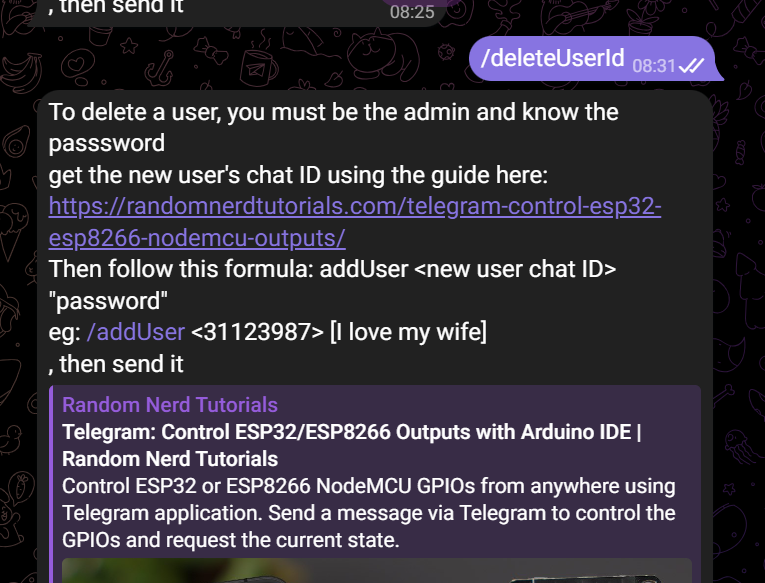

# 🌿 IoT Automated Greenhouse System Using FreeRTOS

## Project Introduction
An intelligent, self-regulating greenhouse system built using an **ESP32 micro-controller**. It monitors environmental parameters such as temperature, humidity, soil moisture, and light intensity, and automatically controls actuators like a fan, water pump, and lighting for optimal plant growth. Real-time monitoring and control is implemented using **Telegram chat bot**.

---

## 📖 Table of Contents

- [Acknowledgments](#acknowledgments)
- [Features](#features)
- [Tech Stack](#tech-stack)
- [Hardware Used](#hardware-used)
- [Construction Process](#construction-process)
- [Project Plans / To-Dos](#project-plans--to-dos)
- [Project Status](#project-status)
- [Task Scheduling and Architecture](#task-scheduling-and-architecture)
- [Telegram Bot Integration](#telegram-bot-integration)
- [Pictures](#pictures)
- [Markup/HTML Explanation](#markuphtml-explanation)
- [How to Use](#how-to-use)
- [Author](#author)
- [To Ask Questions](#to-ask-questions-on-the-project)
- [License](#license)

---

## ✨ Features

- 🌡️ Monitors temperature and humidity using DHT11
- 💧 Detects soil moisture to automate irrigation using soil moisture sensor.
- ☀️ Adjusts lighting based on ambient light using an LDR and an led.
- 🚨 Controls the tungsten bulb using relays
- 😇 pump and fan are controlled using C1815 transistor.
- 🔔 Buzzer alerts when conditions exceed thresholds
- 📺 Displays real-time environmental data on a 20x4 I2C LCD
- 📩 Telegram bot interface for remote interaction and updates

---

## 🛠️ Tech Stack

- **Micro-controller:** ESP32 Dev Board  
- **Firmware:** Arduino IDE (C/C++)  
- **Communication:** I2C for LCD, GPIOs for sensors and actuators  
- **Telegram Bot:** Improved version from my previous IoT project. started with [Random Nerds tutorial code 3 years ago](https://randomnerdtutorials.com/telegram-control-esp32-esp8266-nodemcu-outputs/), **but I have made a lot of improvements** over the years. Examples of improvements made:
  - I made the code reuseable using more functions and Variables.
  - I added admin management whereby the admin can easily add/authorize or even delete/remove users by adding there telegram chat ID using simple bot command with password and it's saved on esp32 SPIFFS, then it will be loaded during boot/setup.
  How to add Users:
  
  How to delete Users:
  
  - 

---

## 🔌 Hardware Used

- ESP32 Development Board  
- 20x4 I2C LCD  
- DHT11 Temperature & Humidity Sensor  
- Soil Moisture Sensor  
- LDR  
- Relay  
- C1815 NPN Transistor  
- 1N4007 Diode  
- 4.7kΩ Resistor, 10µF & 100µF Capacitor  
- 200W Tungsten Bulb  
- Mini blowing Fan  
- 5v DC Water Pump  
- 12V 1.5A Step-down Transformer  
- PVC Box (6x9 inch), Vero-board, Hot Glue, etc.  

---

## 🏗️ Construction Process

> The key stages include:

- Designing a stable transformer-based 5V power supply using: 
  - 12v 1.5A transformer,
  - full-wave bridge rectifier,
  - 100uf 50v filter capacitor and 
  - LM2595 BUCK converter/voltage regulator.
- Soldering the ESP32, sensors, and actuators onto a veroboard using male and female headers when needed.
- Wiring and mounting components inside a PVC enclosure
- Configuring relays with a transistor driver circuit for switching the 200W tungsten built.

---

## ⚙️ How to Use

1. Star, then Clone the repository.
1. Remember create the `<secretCredentials.h>` it should look like the example below:
```cpp
// more info on telegram bot using esp32 here: https://randomnerdtutorials.com/telegram-control-esp32-esp8266-nodemcu-outputs/

// secretCredentials.h

// Wi-Fi SSID (network name) used by the device to connect to the internet
#define wifiSsid "your_wifi_name"

// Wi-Fi password for the above SSID
#define wifiPassword "your_wifi_password"

// Telegram Bot Token generated from BotFather
#define botToken "your_bot_token_here"

// Telegram chat ID of the admin user (can be used to restrict access)
#define adminChatId "your_admin_chat_id"

// Password used for authenticating administrative actions (optional)
#define adminPassword "your_admin_password"

```
1. Construct the circuit according to the circuit diagram:

1. Upload the firmware to ESP32 via Arduino IDE 
1. Power system via 220V AC (via transformer + PSU)  
1. Connect to Wi-Fi  
1. Begin receiving live sensor data on LCD and Telegram  
1. Watch as the system automatically adjusts fan, water pump, and lights

---

## 🚧 Project Status
🔃  Ongoing

<!-- ✅ Fully implemented and tested   -->
<!-- ⚡ Field-ready for smart greenhouse operations   -->
<!-- 🛠 Future features under consideration (e.g., data logging, app dashboard) -->

---

## ⏱ Task Scheduling and Architecture

I use **FreeRTOS for task scheduling** for this project because:
- it improves code organization,  
- allows concurrent execution of tasks,  
- ensures timely sensor data acquisition,  
- prevents **blocking operations**,  
- and enhances the system reliability.

Here is how:
- 🧾 `Task 1: LCD Display`  
  - Priority: 1  
  - Updates the LCD display in a loop
  - with display delay for each onScreen data being set to 2 seconds using `vTaskDelay(2000/portTICK_PERIOD_MS0;`
  
- 📩 `Task 2: Telegram Bot Handler`  
  - Priority: 2  
  - Handles incoming messages from Telegram
  
- 🌡️ `Task 3: Sensor Readings and Actuator Activations`  
  - Priority: 2  
  - Polls all sensors every 2 seconds to ensure timely and accurate data collection, and triggers actuators based on conditions.


---

## 🤖 Telegram Bot Integration

This project started as an upgrade from the chatbot used in the previous project:  
**SMART COOKER BURNING PREVENTION SYSTEM WITH IOT INTEGRATION**

### Improvements:
- Better task scheduling using priority-based task separation  
- More stable and faster bot message handling  
- Clearer display of sensor values in chat  
- Ability to control actuators or request logs from chat interface  

---

## 🖼 Pictures

_Add images of your final project setup, LCD screen output, wiring layout, and enclosure here_


## 📌 Project Plans / To-Dos

- [x] Upgrade Telegram Bot logic from previous project and tailor it for this project
- [x] Implement sensor reading + LCD update  
- [x] Complete circuit construction and couplings.
- [ ] Power optimization using deep sleep modes  

---

## ❓ To Ask Questions on the Project

You can:
- Open a GitHub issue in this repository
- Contact me via.......
- Submit a pull request with improvements or feedback

---

## 🙏 Acknowledgments

- Inspiration: Previous project on Smart Cooker IoT Safety  
- Libraries: DHT sensor lib, LiquidCrystal_I2C, UniversalTelegramBot  
- Mentors, colleagues, and students who helped in testing.

---

## 👨‍💻 Author

**Lawal Hamzat**  
Founder, CEO – Hamzatronics Technologies  
- GitHub: [@yourusername](https://github.com/yourusername)  
- Email: mrlawalhamzat@gmail.com  
- Telegram: [@yourhandle] *(optional)*  
- LinkedIn: *https://linkedin.com/*

---

## 📄 License

This project is licensed under the MIT License. See the [LICENSE](LICENSE) file for details.
